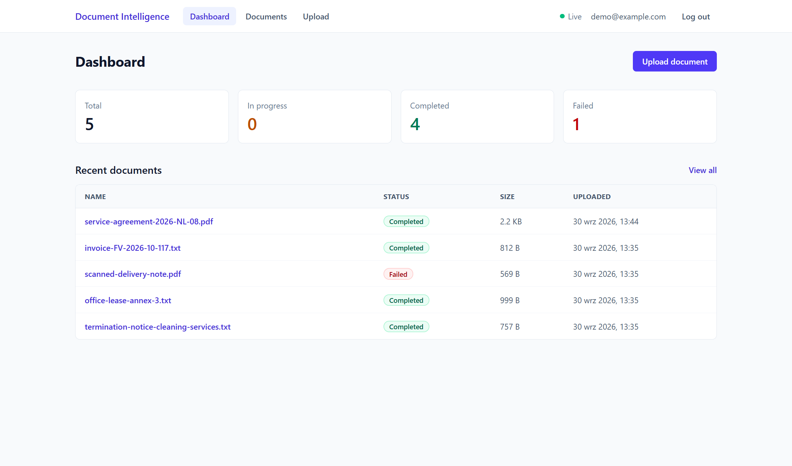
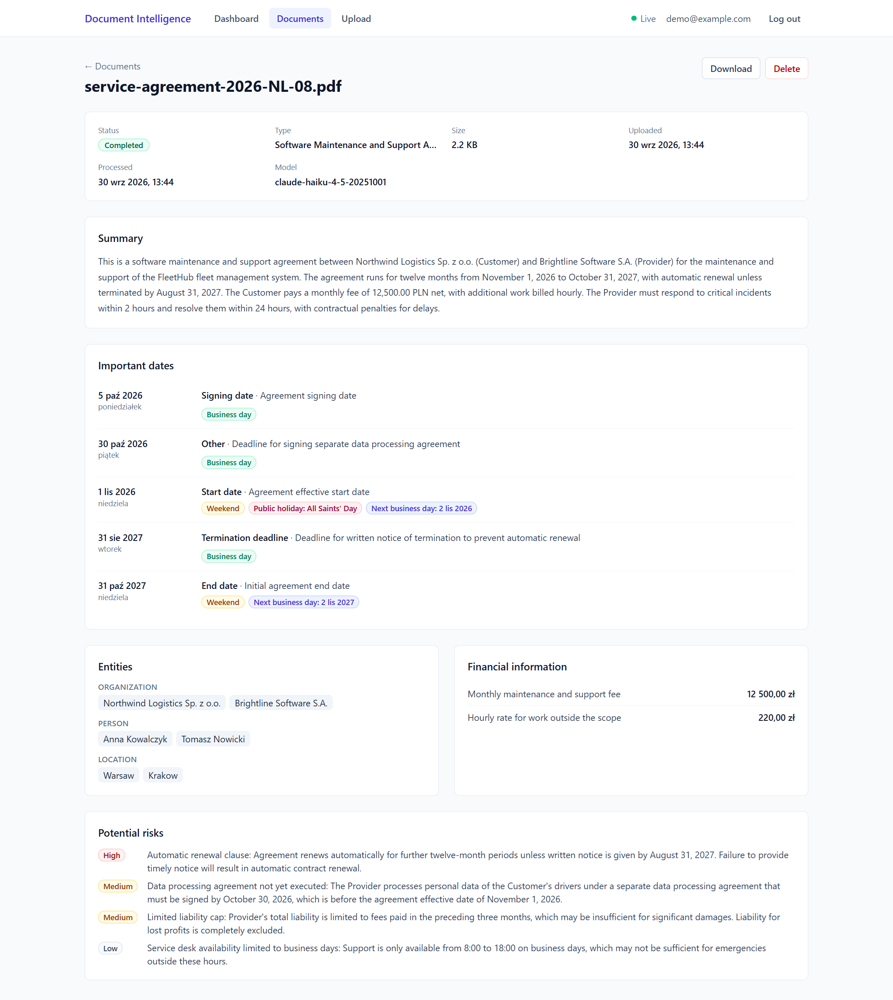
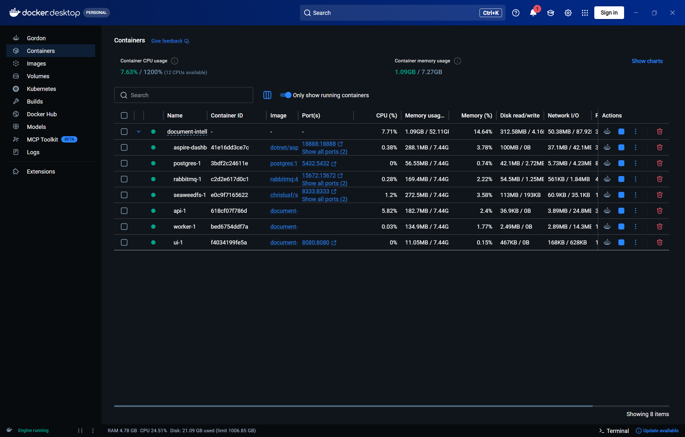
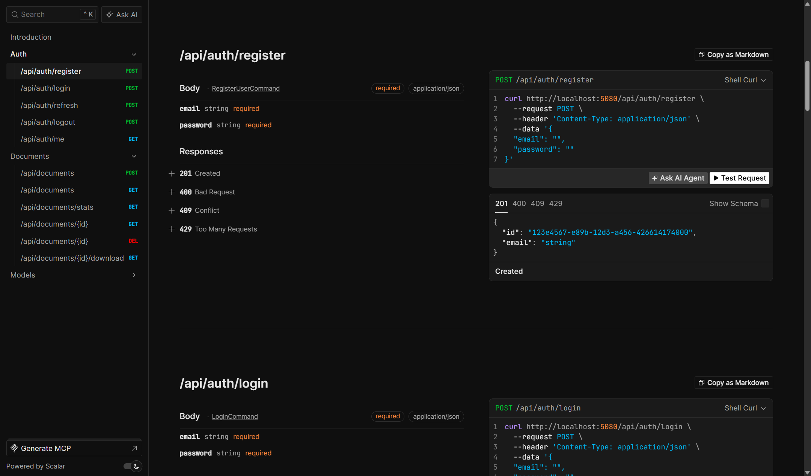
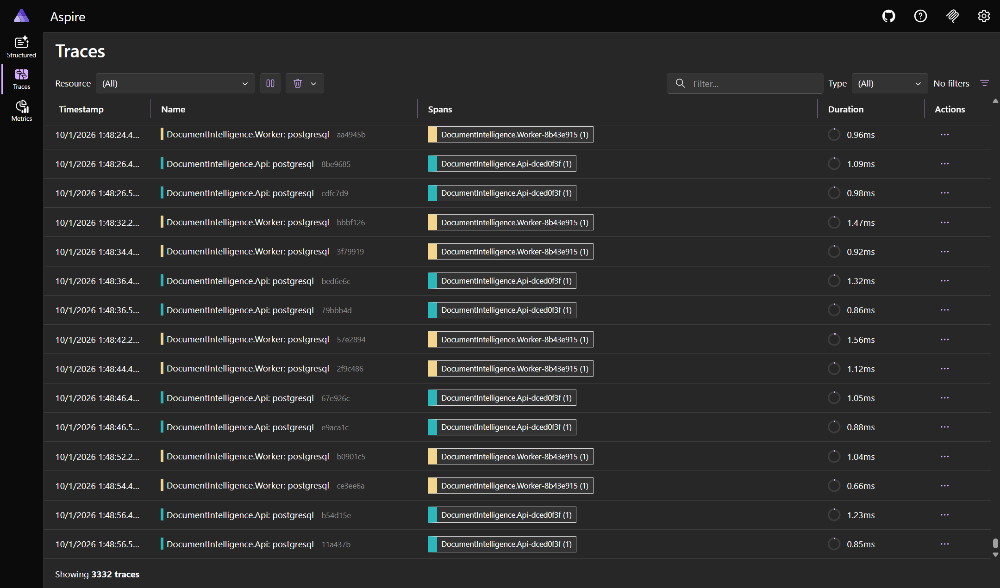
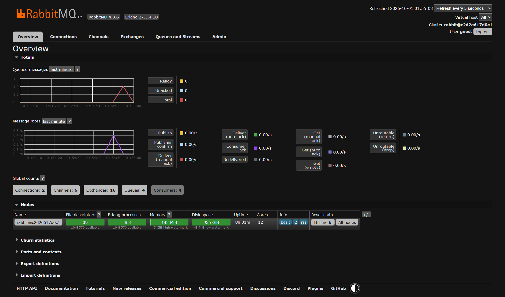
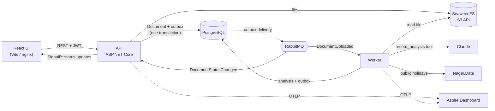

# AI Document Intelligence Platform

[](https://github.com/dut00/ai-document-intelligence-platform/actions/workflows/ci.yml)

Upload a contract, an invoice or a letter, and get back a structured analysis: the document type, a summary, the parties, the important dates with their meaning, the amounts and the potential risks. The dates are checked against the public-holiday calendar, so a payment deadline falling on a holiday is flagged together with the next business day.

This is a portfolio project. Its focus is less on features and more on how a production-oriented system is put together:

- Clean Architecture with DDD and CQRS;
- reliable asynchronous processing: transactional outbox and inbox, retries, a dead-letter queue, idempotency;
- a careful AI integration: structured output, validation, one correction round, prompt-injection hygiene;
- tests against real infrastructure;
- Docker, CI and observability.

It was built with Claude Code; [docs/ai-development.md](docs/ai-development.md) describes how.

## Screenshots

The documents below are fictional; they were analyzed by `claude-haiku-4-5-20251001`.

**Dashboard.** Counts by status, and the latest uploads. The scanned PDF has no text layer, so it failed.



**Document details.** Summary, dates with calendar checks (1 November 2026 is a Sunday and All Saints' Day, so the next business day is shown), parties, amounts and risks ranked by severity.



### Behind the scenes

**Docker.** The `full` profile: the infrastructure, the API, the Worker and the UI, each in its own container.



**API reference.** Scalar UI, generated from the OpenAPI document, with a request builder for every endpoint.



**Observability.** The API and the Worker export traces, metrics and logs over OTLP to the Aspire Dashboard.



**Messaging.** RabbitMQ management: the queues and consumers of the Worker and the API.



## How it works



1. The API validates the upload (at most 10 MB; PDF or TXT, checked by extension, content type and magic bytes) and stores the file in SeaweedFS. In one transaction it saves the document as `Pending` and puts `DocumentUploaded` in the outbox, then answers `202 Accepted`.
2. The Worker takes the message, extracts the text (PdfPig for PDF, UTF-8 for TXT) and sends it to Claude. Claude is forced to answer through the `record_analysis` tool, whose JSON schema is the output format. The answer is validated; an invalid one goes back to the model once with the list of errors.
3. **The AI only identifies dates and what they mean. The backend checks them**: whether a date falls on a weekend or a public holiday (Nager.Date), and which day is the next business day. If Nager.Date is down, the document still completes, and the UI shows "Calendar check unavailable".
4. The document becomes `Completed` (or `Failed`, with a reason), and `DocumentStatusChanged` reaches the owner's browser through SignalR.
5. Transient failures (AI rate limits, network) are retried with exponential backoff. Once the retries run out, the document is marked `Failed` and the message lands in the `_error` queue. Permanent failures fail at once: a scanned PDF without text, an unreadable file, an analysis that is still invalid after the correction.

More detail: [docs/architecture.md](docs/architecture.md) and [docs/decisions.md](docs/decisions.md).

## Stack

| Area | Technology |
| --- | --- |
| Backend | .NET 10, ASP.NET Core Minimal API, OpenAPI + Scalar UI, FluentValidation, Scrutor |
| Data | PostgreSQL 17, EF Core (Npgsql), ASP.NET Core Identity (core) |
| Messaging | MassTransit 8 with RabbitMQ, EF Core transactional outbox and inbox |
| Storage | SeaweedFS through its S3 API (`AWSSDK.S3`) |
| AI | Anthropic Claude (official `Anthropic` SDK), `claude-haiku-4-5-20251001` by default |
| Documents | PdfPig; Nager.Date for public holidays |
| Real time | SignalR |
| Frontend | React 19, Vite, TypeScript, React Router, TanStack Query, Tailwind CSS, oxlint |
| Observability | Serilog (JSON), OpenTelemetry, Aspire Dashboard |
| Tests | xUnit v3 on Microsoft.Testing.Platform, Shouldly, NSubstitute, Testcontainers, MassTransit test harness |
| Delivery | Docker (multi-stage, non-root), docker compose, nginx, GitHub Actions |

## Running it

Prerequisites: Docker. For the local development setup you also need the .NET 10 SDK and Node.js 22.12 or later.

```sh
cp .env.example .env
```

### Everything in Docker

The API runs in the Production environment there, so it needs a signing key of its own. Set `JWT_SIGNING_KEY` in `.env`, e.g. to the output of `openssl rand -base64 48`. The API refuses to start without one.

```sh
docker compose --profile full up -d --build
```

Every port is published on `127.0.0.1` only. The infrastructure uses the public development credentials from `.env.example`, and the dashboards have no login, so none of it should be reachable from other machines.

| URL | What |
| --- | --- |
| http://localhost:8080 | the app (nginx serves the UI and proxies the API) |
| http://localhost:8080/scalar | API reference and a place to try the API |
| http://localhost:18888 | Aspire Dashboard: traces, metrics and logs |
| http://localhost:15672 | RabbitMQ management (`guest` / `guest`) |

### Local development

The infrastructure runs in Docker; the API, the Worker and Vite run on the host:

```sh
docker compose up -d                                   # Postgres, RabbitMQ, SeaweedFS, Aspire Dashboard
dotnet run --project src/DocumentIntelligence.Api      # http://localhost:5080 (Scalar at /scalar)
dotnet run --project src/DocumentIntelligence.Worker
cd frontend && npm install && npm run dev              # http://localhost:5173
```

In Development the API applies the EF Core migrations on startup, and the Vite dev server proxies `/api` and `/hubs` to it, so the browser sees a single origin.

### Upgrading an existing setup

The message queues are RabbitMQ quorum queues. A RabbitMQ volume created by an earlier version of this project still holds classic queues of the same names, and a queue cannot change its type, so the Worker would fail to start. Recreate the RabbitMQ volume once (the documents in Postgres and SeaweedFS are kept):

```sh
docker compose rm -sf rabbitmq
docker volume rm document-intelligence_rabbitmq-data
docker compose up -d rabbitmq
```

### Claude

Without an API key the Worker uses a deterministic fake analyzer: it finds dates and amounts with regular expressions and logs a warning. Everything else works the same. To use Claude:

```sh
dotnet user-secrets set Anthropic:ApiKey <key> --project src/DocumentIntelligence.Worker
# or set ANTHROPIC_API_KEY (in .env for the Docker profile)
```

### Tests

```sh
dotnet test --solution DocumentIntelligence.slnx
(cd frontend && npm run lint && npm run build)
```

The integration tests need Docker. Testcontainers starts PostgreSQL and SeaweedFS, and MassTransit's in-memory test harness replaces RabbitMQ and runs the Worker's consumers in-process. The analyzer is the fake one, so the tests never call Claude.

## Configuration

Settings come from `appsettings.json`, from environment variables (`Section__Key`) and, locally, from user secrets. Docker reads `.env`.

| Setting | Default | Purpose |
| --- | --- | --- |
| `ConnectionStrings:Postgres`, `ConnectionStrings:RabbitMq` | local Docker (Development) | infrastructure |
| `Storage:ServiceUrl`, `AccessKey`, `SecretKey`, `BucketName` | local SeaweedFS (Development) | S3 storage; the bucket is created on startup |
| `Jwt:SigningKey` | Development only | HMAC key, at least 32 characters (`JWT_SIGNING_KEY` in Docker) |
| `Jwt:AccessTokenLifetime` / `RefreshTokenLifetime` | 15 min / 7 days | token lifetimes |
| `Jwt:RefreshTokenReuseGracePeriod` | 10 s | how long a just-rotated refresh token is still accepted |
| `Anthropic:ApiKey` (or `ANTHROPIC_API_KEY`) | none, so the fake analyzer | Claude access |
| `Anthropic:Model`, `MaxTokens`, `Timeout`, `MaxRetries` | Haiku 4.5, 4096, 2 min, 2 | the Claude request |
| `Holidays:CountryCode`, `BaseUrl`, `CacheDuration` | `PL`, Nager.Date, 24 h | the calendar check |
| `Messaging:Retry:*` | 5 retries, 1 s to 30 s | exponential message retry before the DLQ |
| `RateLimiting:*` | 20 auth requests/min and 10 registrations/day per IP; 5 login attempts without a success per account and IP in 15 min, and a 3 s delay per attempt beyond 50 for an account from all addresses (slows sequential, not parallel, guessing); 10 uploads, then 2/min per user | rate limits |
| `Documents:MaxDocumentsPerUser`, `DailyAnalysisLimitPerUser`, `DailyAnalysisLimit` | 200, 20, 500 | storage quota per user; AI analyses per user and across all users in 24 h |
| `ForwardedHeaders:KnownProxies` / `KnownNetworks` | none (loopback only) | proxies trusted for `X-Forwarded-For` |
| `OpenApi:Enabled`, `Database:MigrateOnStartup` | on in Development | Scalar UI and migrations outside Development |
| `OTEL_EXPORTER_OTLP_ENDPOINT` | Aspire Dashboard (Development) | telemetry export; empty turns it off |

## API

| Endpoint | |
| --- | --- |
| `POST /api/auth/register`, `login`, `refresh`, `logout`; `GET /api/auth/me` | accounts and sessions |
| `POST /api/documents` | upload (multipart), `202` with `Location` |
| `GET /api/documents?page=&pageSize=&status=` | paginated list |
| `GET /api/documents/{id}`, `/{id}/download`, `DELETE /api/documents/{id}` | details with the analysis, the original file, delete |
| `GET /api/documents/stats` | dashboard counts |
| `/hubs/documents` (SignalR) | `DocumentStatusChanged` for the owner's documents |
| `GET /health/live`, `/health/ready` | liveness; readiness of Postgres, storage and the bus |

Errors are ProblemDetails with a `traceId`. Another user's document answers `404`, so its existence is not revealed.

## Design decisions in brief

- **Custom CQRS handlers instead of MediatR, and MassTransit 8 instead of 9:** both alternatives now have commercial licenses. The handlers are a few interfaces with validation and logging decorators, registered with Scrutor.
- **One database for commands and queries.** Queries project straight to DTOs with `AsNoTracking`. A separate read store would add infrastructure without solving a real problem.
- **The outbox carries every message.** A document is never saved without its message, and no message is sent for a document that was not saved.
- **Idempotent processing:** a MassTransit inbox, a conditional status transition, and `xmin` optimistic concurrency. A redelivered or duplicate message cannot process a document twice or overwrite a newer state.
- **The AI identifies, the backend verifies.** Deciding whether a date is a public holiday is deterministic work, so it is done in code and cached per year and country.
- **Tokens:** the access token lives only in memory, and the refresh token in an httpOnly `SameSite=Strict` cookie scoped to `/api/auth`. Refresh tokens are hashed, rotated and checked for reuse, with a short grace period for a response the browser lost.
- **SeaweedFS rather than MinIO,** because MinIO no longer publishes container images. Any S3-compatible store fits behind `IFileStorage`.

The full list, with the alternatives considered, is in [docs/decisions.md](docs/decisions.md).

## Repository layout

```
src/
  DocumentIntelligence.Domain/          aggregates, value objects, domain events (no dependencies)
  DocumentIntelligence.Application/     commands, queries, handlers, ports, validators, DTOs
  DocumentIntelligence.Contracts/       integration messages
  DocumentIntelligence.Infrastructure/  EF Core, Identity/JWT, S3, MassTransit, Claude, Nager.Date, PdfPig
  DocumentIntelligence.ServiceDefaults/ Serilog, OpenTelemetry, health checks
  DocumentIntelligence.Api/             Minimal API, SignalR hub, rate limiting (+ Dockerfile)
  DocumentIntelligence.Worker/          MassTransit consumers (+ Dockerfile)
frontend/                               React app, nginx config (+ Dockerfile)
tests/                                  UnitTests, IntegrationTests
docs/                                   architecture, decisions (ADRs), AI-assisted development
```

## Out of scope

OCR for scanned PDFs, file formats other than PDF and TXT, email confirmation and password reset, external identity providers, roles, document sharing and search, and cloud deployment.
