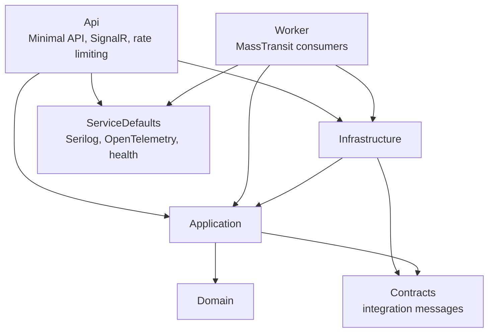
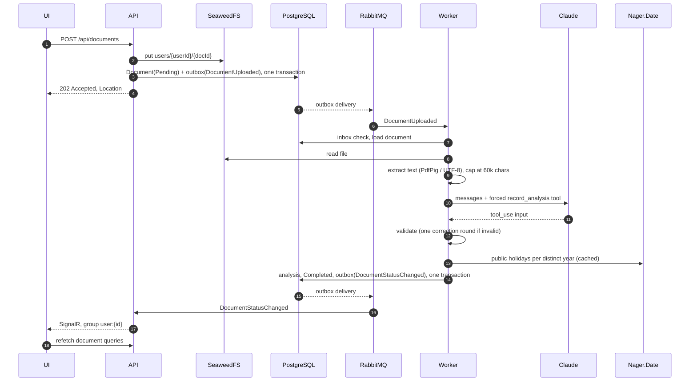
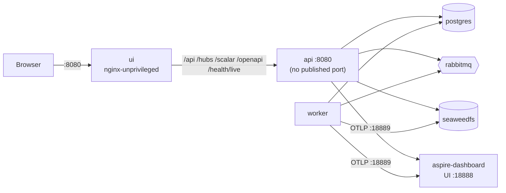

# Architecture

The system has two .NET processes, the **API** and the **Worker**, and a React single-page app. They share one PostgreSQL database, one RabbitMQ broker and one S3 bucket. The reasons behind the choices are in [decisions.md](decisions.md).

## Layers



| Project | Holds | Depends on |
| --- | --- | --- |
| Domain | the `Document` aggregate, value objects, domain events, `IDocumentRepository`, `IUnitOfWork` | nothing |
| Application | commands, queries and their handlers, validators, DTOs, ports (`IFileStorage`, `IDocumentAnalyzer`, `IPublicHolidayProvider`, `IReadDbContext`, …) | Domain, Contracts, EF Core (for query projections) |
| Contracts | `DocumentUploaded`, `DocumentStatusChanged`, `DocumentDeleted` | nothing |
| Infrastructure | EF Core, Identity, JWT, refresh tokens, S3, MassTransit, Claude, Nager.Date, PdfPig | Application, Contracts |
| Api / Worker | the hosts: endpoints, the hub, consumers | everything above |

`LayerDependencyTests` checks the project references of the inner layers: Domain, Contracts and Application must not depend on anything outward, so such a reference fails the test run. The outer projects' references are not checked.

## Domain model

`Document` is the only aggregate. It owns its `DocumentAnalysis` and allows only these transitions:

```mermaid
stateDiagram-v2
    [*] --> Pending: Upload()
    Pending --> Processing: StartProcessing()
    Processing --> Processing: StartProcessing() after 15 min (stale; a safeguard)
    Processing --> Completed: Complete(analysis)
    Processing --> Failed: Fail(reason)
    Pending --> Failed: Fail(reason) (retries exhausted)
    Completed --> [*]
    Failed --> [*]
```



- An invalid transition throws `DomainException`.
- `MarkForDeletion()` raises `DocumentDeletedDomainEvent` with the storage key, so the file can be removed once the row is gone.
- **Value objects:** `DocumentId`, `UserId`, `FileName`, `FileSize`, `ContentType` (PDF or TXT only), `StorageKey`, `Money`, `ImportantDate` with an optional `CalendarCheck`, `ExtractedEntity`, `FinancialItem` and `Risk`.
- **Users:** Identity owns the accounts (`ApplicationUser` in Infrastructure, behind `IUserAccountService`). The domain only ever sees a `UserId`.

## Command and query pipeline

- Commands go through a repository and the aggregate. Queries read `IReadDbContext` with `AsNoTracking` and project straight to DTOs.
- Every handler is wrapped in two decorators, registered with Scrutor:
  - `ValidationDecorator` runs FluentValidation and turns failures into a validation `Error`;
  - `LoggingDecorator` logs the use case, its duration and its outcome.
- Handlers return `Result<T>`. The API maps an `Error` to ProblemDetails by its type (validation, not found, conflict, unauthorized).
- Domain events: `DispatchDomainEventsInterceptor` runs their handlers inside `SaveChanges`, before the commit. The handlers publish integration messages through the MassTransit EF Core outbox, so the aggregate's state and its messages are saved in the same transaction.

## Document processing



### Reliability

- **Upload compensation.** The file is stored before the transaction. If saving the row fails, the file is deleted again.
- **Idempotency** has three layers:
  - the MassTransit inbox drops a message it already consumed;
  - the handler skips a document that is missing, finished, or being processed elsewhere (`CanStartProcessing`);
  - the `xmin` concurrency token rejects a save if the row changed since it was read.
- **No early `Processing` commit.** The whole attempt runs in the consumer's outbox transaction, and `Processing` is never saved on its own. Committing it first would lock the row for the whole AI call and block a concurrent delete. The `xmin` check on the final save still catches a document that changed or was deleted in the meantime.
- **Transient and permanent failures:**
  - `UnprocessableDocumentException` is permanent: no text layer, an unsupported or unreadable file, an AI request the service rejected, or an analysis that is still invalid after the correction. The document is marked `Failed` right away, with no retry.
  - Anything else is thrown, and MassTransit retries it with exponential backoff (`Messaging:Retry`). Before that, the Anthropic SDK has already retried rate limits and 5xx responses itself.
  - One attempt is capped at 5 minutes (`ProcessDocumentCommand.ProcessingDeadline`), deliberately less than the AI call's own budget: with the default timeout and SDK retries a request may take up to 6 minutes, and about 12 with the correction round. An attempt that runs into the cap is cancelled and retried as a whole.
  - Nager.Date calls use `Microsoft.Extensions.Http.Resilience`.
- **Dead-letter queue.** Once the retries are exhausted, the message moves to `document-uploaded_error`, and `DocumentUploadedFaultConsumer` marks the document `Failed` with a neutral reason. The technical details stay in the log and in the error queue.
- **Worker crash.** The transaction rolls back, so the document is still `Pending`, and the unacknowledged message is redelivered. As a safeguard, the domain also lets a document that sat in `Processing` for more than 15 minutes be picked up again, although this flow never commits that state.
- **A message that keeps crashing the Worker.** A crash never reaches the retry policy, so a hostile file could otherwise kill every Worker in turn, forever.
  - The endpoints use RabbitMQ quorum queues, which count unacknowledged deliveries in transport headers (`x-delivery-count`, `x-acquired-count`).
  - A dying Worker returns every message it held, including innocent documents processed next to the culprit. So a redelivered `DocumentUploaded` is not processed on the main endpoint. `DocumentUploadedConsumer` hands it to `document-processing-isolated`, which processes one document at a time (concurrency 1, prefetch 1).
  - That endpoint runs in a Worker process of its own (`Worker:Role` = `Isolated`; the `full` profile's `worker-isolated` container), so a crash there can only be the doing of the document being processed. After 3 interrupted deliveries `IsolatedDocumentConsumer` marks it `Failed`. Run locally with the default role `All`, both endpoints share one process and that guarantee does not hold.
  - The hand-over is sent to the endpoint's exchange: a `queue:` address would make the sender declare a classic queue, which RabbitMQ refuses for a quorum one.
  - RabbitMQ silently drops what an exchange cannot route. A `Main` Worker therefore declares the isolated quorum queue and its binding on startup (`IsolatedQueueDeclarer`), so a hand-over is never lost before an `Isolated` Worker has started.
  - The main endpoint fetches no more messages ahead than it processes (prefetch 4), and on shutdown a Worker finishes the documents in hand (one attempt is capped at 5 minutes, `ProcessDocumentCommand.ProcessingDeadline`; MassTransit lets consumers run 30 seconds longer before cancelling them, the host waits longer still, and the containers' grace period is 8 minutes). A deploy or restart therefore returns no message unfinished, so it is not counted as an interruption.
- **Hostile input.**
  - Text extraction stops after 500 pages, or once the text budget (60,000 characters) is exceeded. After one minute the Worker stops waiting and the document fails without a retry. PdfPig cannot be interrupted inside a page, so it runs on its own thread: the abandoned parse goes on until its next page check. At most 8 parses (twice the consumer slots), abandoned ones included, run at once per process; a new PDF waits for a free one, and the wait does not count against its timeout. A parse still running 2 minutes after it was abandoned will not end on its own, so the Worker logs it as critical and stops gracefully: it takes no new messages, finishes the documents in hand and exits, and the container restarts. If it is still alive 10 minutes later, it is killed.
  - The Worker containers have memory (1 GB) and CPU limits, so a parser that runs away hits the container's limits, not the host's.
  - A Worker processes at most 4 documents at a time.
- **Delete.** The row is removed, and the file is deleted afterwards by `DocumentDeletedConsumer`, fed from the outbox. A file is therefore never deleted for a transaction that rolled back. A redelivered message is harmless, because deleting a missing object succeeds.
- **Calendar outage.** A Nager.Date failure never fails a document. The dates are saved with `CalendarCheck = null`, and the UI shows "Calendar check unavailable".

### AI analysis

`ClaudeDocumentAnalyzer` sends one user message holding the document text, wrapped in `<document>` tags, and forces the `record_analysis` tool with `tool_choice`.

- **Schema.** The tool's JSON schema defines the output: document type, summary, entities, important dates (with type and description), financial items (amount and ISO currency) and risks (with severity). The enum values in the schema are generated from the domain enums, so the schema and the code cannot drift apart.
- **Prompt injection.** The system prompt says the document is untrusted data. Any tag inside the text that could open or close the `<document>` block (`</document >`, `</ Document x>`, …) is rewritten into a harmless bracketed word.
- **Validation.** The tool input is deserialized and checked by `AnalysisResultValidator`:
  - dates must be real `YYYY-MM-DD` values;
  - enum values must be known;
  - currencies must be three-letter codes;
  - lengths are bounded.
- **One correction.** An invalid answer is sent back once as an `is_error` tool result that lists the problems. A second invalid answer fails the document.
- **Logs.** The log records only where the answer was invalid (property and rule), never the values, because those may quote the document.
- **Cost limits.**
  - Before each analysis the Worker checks two daily caps in an append-only usage log (`AnalysisUsage`): `Documents:DailyAnalysisLimitPerUser` (20) and `Documents:DailyAnalysisLimit` across all users (500). Over a cap, the document fails and asks the owner to upload it again later.
  - The log is saved with the outcome, so analyses that ended `Failed` after invalid answers count too. Deleting documents does not shrink it.
  - Uploads are also limited per user: a quota of documents kept, and a token bucket for new uploads.
  - Registration is limited per IP address, so the per-user limits cannot be multiplied with free accounts.
- **No `temperature`:** newer models accept only the default.
- **Fake analyzer.** Without an API key, `FakeDocumentAnalyzer` produces a deterministic analysis with regular expressions, so the whole pipeline runs offline and in tests.

### Calendar checks

`DateInsightsService` enriches each date the AI found:

- it checks for a weekend locally;
- it checks for a public holiday through `IPublicHolidayProvider` (Nager.Date, cached per year and country for `Holidays:CacheDuration`);
- it finds the next business day, skipping any mix of weekends and holidays.

A document without dates makes no calls. Dates spread over several years make one call per distinct year. Only the 5 years closest to today are checked: the dates come from the model, which reads untrusted text. Dates in any other year are saved without a check.

## Authentication

- **Accounts:** ASP.NET Core Identity (`AddIdentityCore`, no roles), with `Users` as the table name.
- **Failed logins:** there is no account lockout, which would let anyone lock a known email out.
  - Instead, `LoginAttemptThrottle` counts each login attempt before the password is checked, keyed by a hash of the email as Identity normalizes it, and refuses a client IP address after 5 attempts without a success for one account within 15 minutes. Counting first means concurrent guesses cannot all slip in before the first failure is recorded. The owner, signing in from another address, is not affected.
  - Across all addresses, an account gets 50 attempts without a success per 15 minutes; beyond that every attempt waits 3 seconds before the password is checked. That slows down sequential guessing without locking the owner out. It does not limit parallel guessing: requests sent at once all wait and are all checked, so what bounds an attacker with many addresses is each address's own budget. A successful login by the owner clears the account-wide count.
  - Registration is limited to 10 per IP address per day, so one address gets at most 10 x 20 analyses a day, well below the overall 500.
  - A login for an unknown email still verifies the password against a dummy hash, so its response time does not reveal whether the account exists.
  - Per-client limits count an IPv6 client by its /64 prefix, which one subscriber usually holds whole.
  - Outside Development, the API refuses to start with a JWT signing key published in the repository.
- **Access token:** a JWT (HMAC SHA-256) that lives for 15 minutes. `sub` is the user id.
- **Refresh token:** 512 random bits. It is sent in an httpOnly, `Secure`, `SameSite=Strict` cookie scoped to `/api/auth`, and stored only as a SHA-256 hash.

Refresh-token rotation:

- Every refresh revokes the presented token and issues its successor (`ReplacedByHash`). `xmin` makes sure only one of two parallel refreshes can win.
- **Reuse detection.** If a token that was already rotated comes back, somebody holds a copy, so every active session of the user is revoked.
- **Grace period** (`Jwt:RefreshTokenReuseGracePeriod`, 10 s). A token rotated within the window whose successor is still unused is accepted, and the successor is rotated in its place. This covers a browser that reloaded while a refresh was in flight and never stored the new cookie.
- **Logout** follows grace rotations to the live token and revokes it. If the token was rotated by someone else outside the window, the logout counts as reuse.

In the browser, `api/client.ts` keeps the access token in memory:

- it renews the token on the next request once the token is within 30 seconds of expiry;
- on a 401, it refreshes and retries once;
- refreshes are deduplicated within a tab and serialized across tabs with the Web Locks API, so two tabs never present the same token;
- a `BroadcastChannel` tells the other tabs about a sign-in or a sign-out, and a change of `sub` after a refresh reveals that another user signed in.

## Real time

- `DocumentsHub` (`/hubs/documents`) adds each connection to the group `user:{id}`.
- In the API, `DocumentStatusNotifier` consumes `DocumentStatusChanged` and sends it to that group.
- Each API instance holds its own connections, so each gets its own temporary queue (exclusive and auto-deleted) rather than competing with the other instances. No SignalR backplane is needed.
- That endpoint skips the inbox, the outbox and retries. A missed push only delays the UI until its next refetch.
- Only final statuses are pushed, because `Processing` is never committed on its own.
- A browser cannot set headers on a WebSocket, so on the hub path only, the token is also accepted from the `access_token` query parameter. Request logs record the path without the query string.
- The hub closes a connection when its token expires (`CloseOnAuthenticationExpiration`), and the client reconnects with a fresh token.

## Frontend

```
frontend/src/
  api/        fetch client (tokens, refresh, ProblemDetails -> ApiError), DTO types, endpoint functions
  auth/       AuthProvider (loading / anonymous / authenticated / unavailable), route guards
  realtime/   useDocumentStatusHub: SignalR connection, reconnects, query invalidation
  pages/      Login, Register, Dashboard, Documents, Upload, DocumentDetails, NotFound
  components/ layout, tables, status badges, analysis sections, calendar badges
  lib/        formatting, client-side file validation
```

- TanStack Query holds all server state, keyed by `documentKeys`. It does not retry 4xx responses.
- A SignalR event or a reconnect invalidates `['documents']`.
- The client validates uploads (type, size, emptiness) only for a quick answer; the API validates them again.

## Observability

`AddServiceDefaults()` is shared by both hosts:

- **Logs:** Serilog writes JSON to the console, enriched with the trace id.
- **OpenTelemetry:** traces, metrics and logs go over OTLP to the Aspire Dashboard.
- **Instrumentation:** ASP.NET Core and HttpClient (which covers Claude, Nager.Date and S3), plus the `Npgsql` and `MassTransit` sources. One trace follows an upload from the HTTP request through RabbitMQ into the Worker and its outgoing calls.
- **Metrics:** `DocumentIntelligence.Processing` provides `documents.processed` (by outcome) and `ai.analysis.duration` (by model and outcome).
- **Health:** `/health/live` checks the process only. `/health/ready` checks Postgres, the S3 bucket and the bus, and returns a JSON report without exception details.

## Deployment (Docker)



- `docker compose up -d` starts the infrastructure only. The `full` profile adds `api`, `worker` and `ui`, all built from source.
- **Published ports** are bound to `127.0.0.1`. The infrastructure uses public development credentials, and the S3 master, the RabbitMQ management UI and the Aspire Dashboard have no login of their own.
- **Signing key.** The JWT signing key must be set in `.env`, since `.env.example` leaves it empty on purpose, and the API refuses to start without one.
- **Images:** multi-stage builds that restore from the project files first, for layer caching. The .NET images run on `aspnet:10.0` as the non-root `app` user; the UI image runs `nginx-unprivileged`.
- **Start order:**
  - the API waits for healthy Postgres, RabbitMQ and SeaweedFS, and applies the migrations before it reports healthy;
  - the Worker and nginx wait for a healthy API.
- **nginx:**
  - It serves the SPA. `index.html` is sent with `no-cache` and the hashed assets as immutable. CSP, `nosniff` and `no-referrer` apply to the UI only, because the Scalar UI needs inline scripts.
  - Its access log leaves out query strings, which on `/hubs` carry the token.
- **Forwarded headers.** The API reads `X-Forwarded-For` only from the proxies and networks it is configured to trust, and only the last hop. nginx overwrites that header rather than appending to it. Because the API has no published port, trusting Docker's address ranges is safe, and the per-IP rate limit sees real client addresses.

## Testing

| Suite | Covers |
| --- | --- |
| Unit | the aggregate and value objects, the validation decorator, `AnalysisResultValidator`, upload validation, the JWT issuer, `ProcessDocumentCommandHandler` (idempotency, permanent vs transient errors, a calendar outage), `DateInsightsService`, the Nager.Date provider with a fake handler, parsing in the Claude analyzer, layer dependencies |
| Integration | the real API in memory (`WebApplicationFactory`), with Postgres and SeaweedFS in Testcontainers and the MassTransit test harness running the Worker's consumers: the auth flow including rotation, reuse and the grace period; ownership (401/404); upload to `Completed` to download to delete; failures and retries to `Fault`; SignalR delivery to the owner only; rate limits and forwarded headers; health |

CI (`.github/workflows/ci.yml`) runs the backend build and tests, the frontend lint and build, and the Docker image build. It also fails on known-vulnerable NuGet or npm (runtime) packages. Dependabot (`.github/dependabot.yml`) opens weekly, grouped update pull requests.
